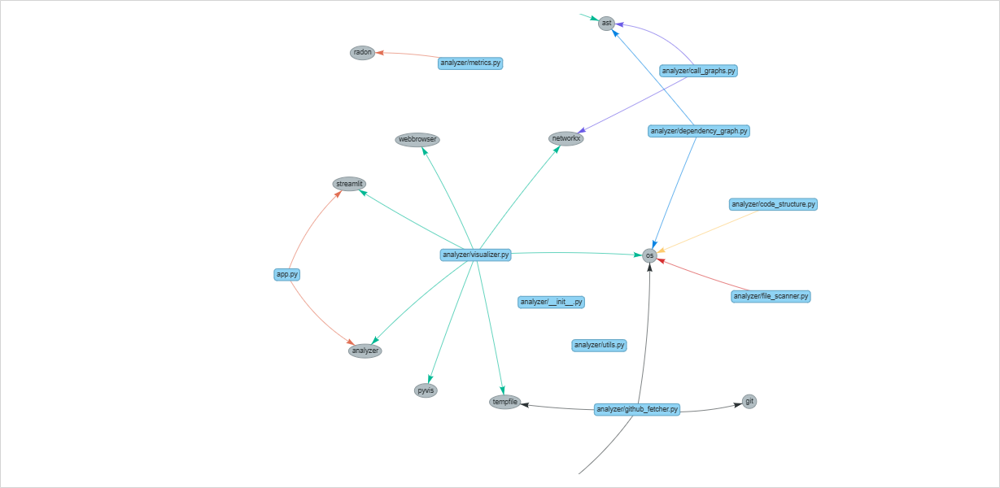

# Code Complexity Visualizer

A powerful and interactive tool to visualize and understand the complexity and structure of any public Python GitHub repository.

This app analyzes **cyclomatic complexity**, detects all **Python modules**, and builds an **interactive dependency graph** of the codebase — making it easier for developers to explore unfamiliar projects or audit their own.

---

## Features

- **Analyze GitHub Repositories**  
  Clone and scan any public Python GitHub repo with a single URL.

- **Cyclomatic Complexity Analysis**  
  Understand function-level complexity using Radon.

- **Visual Code Dependency Graph**  
  Interactive graph showing how modules import each other — with color-coded edges and layout based on usage frequency.

- **Streamlit-based UI**  
  Lightweight, browser-accessible app — no front-end coding needed.

---

## Tech Stack

- **Python 3.10+**
- **Streamlit** – Frontend and interactivity
- **Radon** – Code complexity metrics
- **AST** – Static code analysis for import resolution
- **NetworkX + Pyvis** – Dependency graph visualization
- **GitPython** – Clone GitHub repositories
- **Matplotlib/Plotly (optional)** – For charting if needed

---

## Project Structure

    analyzer/
        ├── github_fetcher.py # Clones GitHub repo to local
        ├── file_scanner.py # Finds all Python files
        ├── metrics.py # Cyclomatic complexity using Radon
        ├── dependency_graph.py # Builds import-based dependency graph
        ├── init.py
        app.py # Streamlit app entrypoint

## Run the app
```bash
pip install -r requirements.txt
python -m streamlit run app.py
```

## Dependency Graph

This image shows  the interactive dependency graph generated by the app itself:

